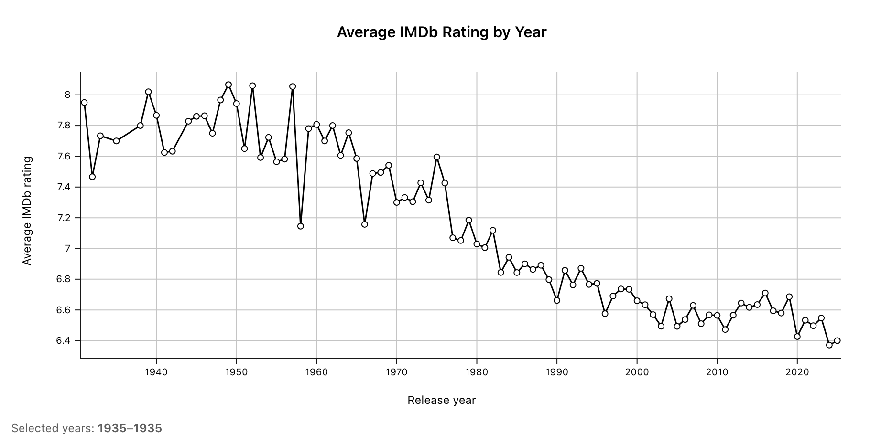
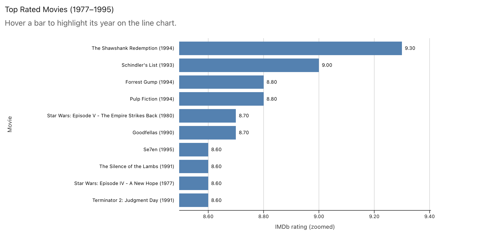

URL to site: https://zoefisk.github.io/a4-linkedviews/

Description of site:

This website uses a CSV of IMBd movies with over 25,000 votes. The csv is from this source https://www.reddit.com/r/datasets/comments/1qbygop/heres_a_dataset_of_the_ratings_of_all_7072_movies/ , so I can't guarantee it's 100% accurate. However, I don't think it matters for the sake of this assignment. Below, I've attached screenshots of both charts with an example brushed area of 1977-1995. Overall, the purpose of these graphs is to get an idea of movie trends over time. However, it is important to note that there is a selection bias in the data, as there are significantly less (but decently high-rated) movies in the 1900s. This, unfortunately, makes the graph appear to show that movies have gotten dramatically worse over time, which is not necessarily true.

Technical achievements:

* Built using NextJS rather than simple html/css/js
* Complex line chart & horizontal bar chart prototypes that can be used for many different types of data
* Making a brush selection on the line chart reflects the data on the bar chart to show the top ten movies of that period of years

Design achievements:

* Though simple, the site overall looks clean and well styled
* Graphs have variable scales that demonstrate more difference between values (for example, the bar chart doesn't have dramatically different values but the scale is expanded to show the difference)
* Added a hover-based tooltip for both graphs that shows additional data. On the line chart in particular, if you hover on a dot, representing a year, it shows the number of movies included, the average rating, and the top movie of that year with its associated rating. 

AI Use:

I used ChatGPT to bounce ideas off of and help with debugging. I definitely had a hard time figuring out how to make the graphs affect one another, so it gave me several hints to move along the way. However, when I make sure to properly take the time to comprehend and break down what it gives me to make sure that it actually makes sense